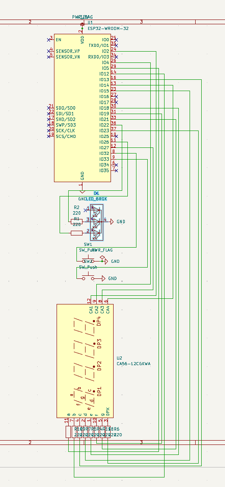
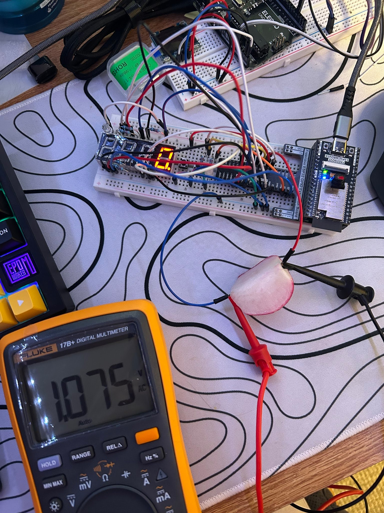

🌱 Organic Signal Transmission via Fourier Analysis
Transmitting Data Through Organic Matter Using FFT + ESP32

Overview
This project explores the feasibility of transmitting and decoding signals through organic matter using frequency-domain analysis with the ESP32 WROVER. The goal was to create a system that could reliably generate and detect analog signals—even in the presence of noise—by leveraging Fast Fourier Transform (FFT) and clever signal processing.

The concept was inspired by bioelectric impedance and the natural capacitive properties of high-water-content organic material.

🧠 Key Features
Single ESP32 signal generator and oscilloscope using ADC pins

Real-time FFT-based frequency detection with noisy signal correction

Button-based frequency control with LED and 7-segment display feedback

Organic signal transmission testing with vegetables and human tissue

Automated frequency sweep from 10–500 Hz and response plotting

Optimized sampling strategy for low-power, high-accuracy FFT

🛠 Hardware Used
ESP32-WROVER Module

7-Segment Display

Push Buttons (x2)

Red/Green LED

Various Vegetables (e.g., cucumber, bell pepper, spinach)

Optional: AC measurement setup for voltage/current sensing

⚙️ System Architecture
🔁 Signal Loop
Signal Generation: The ESP32 DAC outputs a sine wave at a set frequency.

Transmission: Signal passes through a test medium (vegetable/human body).

Acquisition: ADC reads the resulting waveform.

FFT Analysis: Frequency domain transformation detects signal frequency.

Action: Based on frequency, the system performs actions (e.g., LED blink, unlock logic).

📉 Sampling Strategy
Sample Rate: 2048 Hz

Sample Size: 2048 samples

Reason: Powers of 2 ensure FFT efficiency and accuracy, balancing processing time and memory usage.

📊 Experimental Results
Tested 7+ vegetables from the UCLA dining hall

[Link Text]([https://www.example.com](https://docs.google.com/spreadsheets/d/1GZVQGATylODmYl98VlQH3n5RBUiA5maYAZOY3CioH1s/edit?gid=0#gid=0))

All supported AC signal transmission at 3.3V

Voltage attenuation increased with frequency → capacitive behavior

Detected signals across human wrist and even opposite hands

Caution: Human testing raises safety concerns due to current paths through the torso

🔎 Technical Highlights
112% Gain Correction: Compensated for ADC hardware inaccuracies

Nyquist Compliance: Max frequency = 1024 Hz for 2048 Hz sample rate

Frequency Input: Controlled with buttons in ±10 Hz steps

Visual Feedback: 7-segment display + bi-color LED

🔬 Future Work
Apply bioimpedance principles for health sensing (e.g., hydration, muscle mass)

Expand to multi-frequency modulation for data encoding

Explore other conductive organic and biological materials

Implement wireless feedback or logging

📂 Code and Scripts
All code is written in Arduino (C++) and available here:
👉 GitHub Repository Link (insert your actual repo URL)

Includes:

Signal generation logic

ADC capture + FFT implementation

Sweep automation script

Display and LED interface

⚠️ Disclaimer
This project involves low-voltage AC signals applied to living tissue. Do not attempt body-based transmission without understanding electrical safety and the associated risks.

📸 Demo
(Add images or video of your setup here)

ESP32 sending signal through bell pepper

Live FFT output

7-segment feedback display

Vegetable resistance plots

**Schematic for Wiring**

**Reference Picture**

Here is a picture of the FFT signal recognition device receiving a signal through a radish. The frequency values can be used with the measurements from a multimeter to calculate the impedance of the radish and other vegetables.

**Video Demonstration**

[User Input Demonstration](IMG_3596_compressed.mp4)

[Detected Frequency Demonstration](IMG_3604_compressed.mp4)

🧑‍🔬 Author
Jack Shi
Electrical Engineering @ UCLA
📫 jackmshi@ucla.edu
